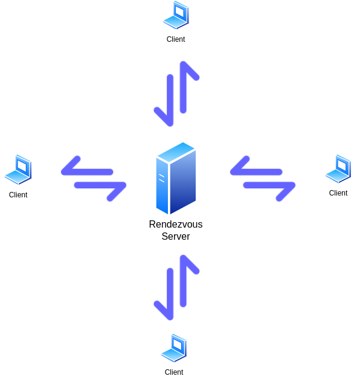
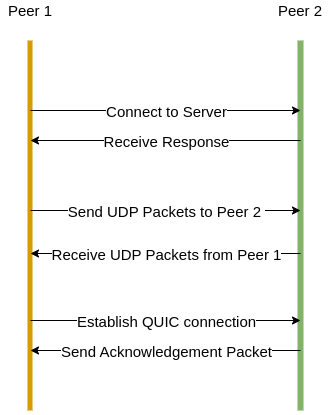
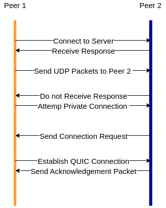
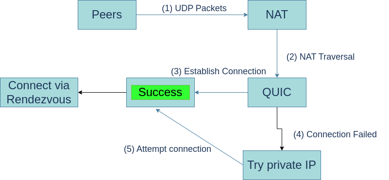

#

# QuicSync

A Decentralized file sharing mechanism using **QUIC (Quick UDP Internet Connections)** protocol

---

# Team

## Members

- **Shoray Singhal** - LCI2020037
- **Nehal Sharma** - LCS2020001
- **Sankalp Sahu** - LCI2020016
- **Mili Singh** - LIT2020032

## Supervisor

- **Dr. Mainak Adhikari** - Assistant Professor, CSE, IIIT Lucknow

---

# Introduction

Our project aims to develop a fast, secure, and user-friendly decentralized file sharing system utilizing QUIC transport protocol. We will employ the encryption features of QUIC to ensure the secure transmission of data. Extensive testing and benchmarking will validate the system's effectiveness and superiority over other existing peer-to-peer file sharing systems. This project aims to test a new implementation of decentralized, peer-to-peer file sharing using the QUIC protocol.

---

# Related Work

<!-- table -->

| **SNo.**                                                                                                                                | **Authors**                    | **Objective**                                                     | **Gap**                                    |
| --------------------------------------------------------------------------------------------------------------------------------------- | ------------------------------ | ----------------------------------------------------------------- | ------------------------------------------ |
| [1](https://www.researchgate.net/publication/223808116_Implementation_and_analysis_of_the_BitTorrent_protocol_with_a_multi-agent_model) | Enrique Costa-Montenegro et al | To Model a BitTorrent network as a multi-agent system             | Incompatible with Binary-Agent system      |
| [2](https://research.google/pubs/pub46403/)                                                                                             | Adam Langley et al             | The QUIC Transport Protocol: Design and Internet-Scale Deployment | Limited Gain on Mobile Devices             |
| [3](https://www.ieee-security.org/TC/SP2013/papers/4977a445.pdf)                                                                        | Karthikeyan Bhargavan et al    | To develop a verified reference implementation of TLS 1.2         | No protection against Side-Channel Attacks |

---

# Motivation


Most decentralized file sharing systems use a peer-to-peer (P2P) networking method using the BitTorrent Protocol. It is designed to work with large numbers of users and handle high-bandwidth connections, making it an efficient and scalable solution for large file sharing.

**But BitTorrent has some drawbacks**:

```markdown
- Reliance on trackers
- Traffic is often unencrypted
- Performance affected by the number of seeders, leechers and network congestion
```

---

# QUIC


#### How using QUIC can help us?:

- **Improved speed and efficiency**
  - Reducing connection setup time, and minimizing protocol overheads.
- **Improved security**
  - Using TLS 1.3 for encryption and authentication.
- **Improved reliability**

  - Using QUIC's loss recovery and congestion control mechanisms.

  **Research Question** : _To compare the performance of the QUIC protocol with other protocols commonly used in decentralized file sharing systems, such as BitTorrent or IPFS._

---

# Scenario (1/3)

### Overall scenario of the project is as follows:

- Peers connect to the rendezvous server and exchange information.

<center>
 
</center>

---

# Scenario (2/3)

<br>

- Peers exchange UDP packets with each other's public IP addresses in an attempt to traverse the NATs. If successful, they establish a QUIC connection.
- If not, they attempt to establish a Quic connection using their private IP addresses.

<center>
 
 
</center>

---

# Scenario (3/3)

<br>

- If a Quic connection is successfully established, the peers can communicate with each other.
- If the private IP connection attempt fails, the peers connect to a rendezvous server to transfer data through the server.

<center>
 
</center>

---

# Workplan (1/2)

### Till now

- Research and planning phase:

  - Studied the QUIC protocol and its implementation.
  - Studied the working of GO and other tools useful for the project.

- Design phase:
  - Designed the overall architecture of the project.
  - Designed the QUIC protocol implementation.

---

# Workplan (2/2)

### Next

- Implementation phase:

  - Implement the QUIC protocol.
  - Implement the rendezvous server.
  - Implement the file sharing system.
  - Implement Encryption and Authentication.

- Testing phase:
  - Test the whole system with contrained bandwidth and latency.
  - Test the system with different number of peers.
  - Test the system with different file sizes.

---

# References

<br>

- BitTorrent, 2009. The official bittorrent page.
  URL http://www.bittorrent.com
- BitTorrent-Specification, 2009. Theory.org.
  URL http://wiki.theory.org/BitTorrentSpecification
- Google, 2019. The QUIC protocol.
  URL https://www.chromium.org/quic
- Chromium QUIC Implementation.
  URL https://cs.chromium.org/chromium/src/net/quic/
- IETF QUIC working group.
  URL https://datatracker.ietf.org/wg/quic/
- T. Acar, M. Belenkiy, M. Bellare, and D. Cash. Cryptographic agility and its relation to circular encryption.
